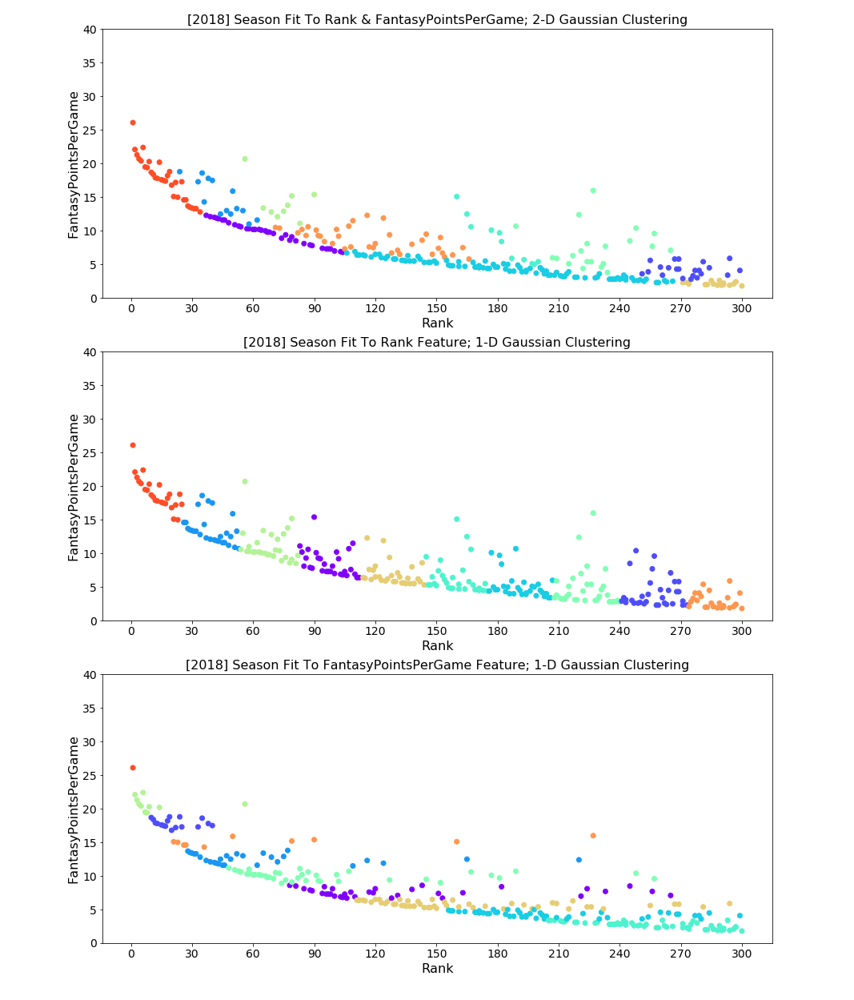
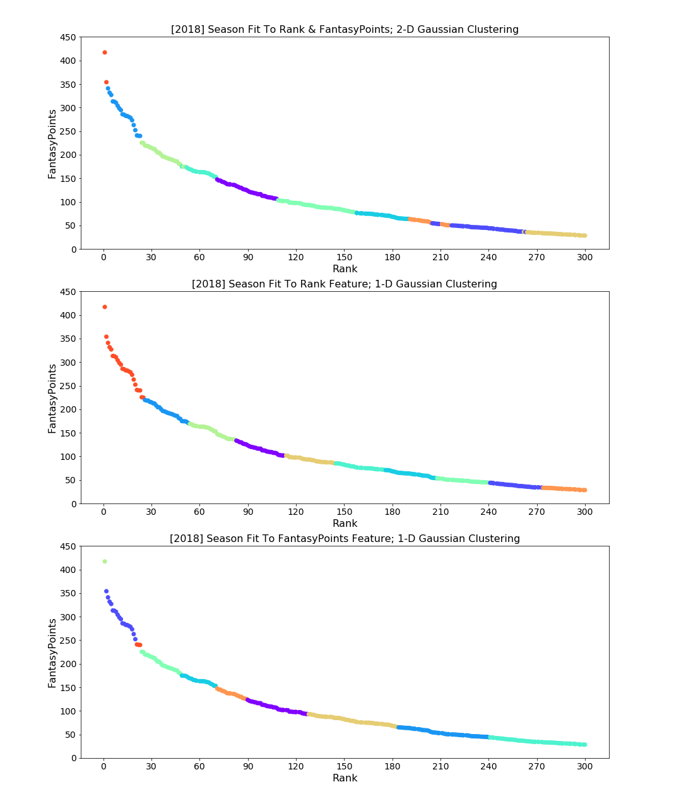

<h2>Fantasy Football Draft Recommendations Using Gaussian Mixture Model Clustering & Predicting Player Performance Using Feed-Forward Neural Network Models</h2>

<h2>Introduction & Problem Statement</h2>

While many fantasy football hosting websites have succeeded in providing moderately accurate draft recommendations and player performance predictions based on each player's performance history, there is still much room for improvement. I’ve used predetermined player performance predictions in the past to select my draft picks for the fantasy football season, but more often than not, I find myself regretting it. Players are continuously predicted to perform at the same fantasy scoring levels or better based on their individual performance in the past. Often times, even if a player is prone to injury, their predicted performance remains unaffected by the strong possibility that they will miss several games that season. The goal of my analysis is to consider a wider variety of features when recommending players to draft and which round to draft them in. The most notable of these features include season rank, total fantasy points, fantasy points per game, number of games played, and position. If there is a synergistic relationship between features, I want to derive those relationships based on data, then use those relationships to generate helpful recommendations of players to draft in priority order. 

The primary goal of this analysis is to develop a model that creates a new ranking system for the highest performing players of the 2018 NFL season. This model would allow for the recommendation of high-quality fantasy draft picks to players before the 2019 NFL season. The secondary goal of this analysis is to develop another model that takes estimated player performance data as inputs, then outputs a prediction of that player's performance on a week-to-week basis. This model would serve as a basis for analyzing trends in top player performance in order to predict how that player will perform the in the following week.

<h2>Data Gathering</h2>

Data for this analysis was gathered from a popular fantasy sport data distributor, www.fantasydata.com, where I was able to locate all necessary data and download data in CSV format. I gathered data representing the top 300 offensive players in each week of the 2018 regular season, the top overall 300 offensive players per season in 2015-2018, and the top 300 offensive players in each week of the 2015-2017 regular seasons. Using www.fantasydata.com made it easy to gather all of this data due to it's mostly proper formatting and ease of access.
 

<h2>Exploratory Data Analysis (EDA)</h2>

Initial exploratory analysis involved inspecting the properties of all data in various jupyter notebooks. I chose to use multiple notebooks for organization purposes and clean manipulation of related and unrelated data. After examining the data, new features were added in order to distinguish the multitude of data frames (e.g. season year). Once distinguishing features were added, related data frame objects were concatenated easily with few to no errors. Lastly, I saved my new data frame objects in CSV file format, resulting in access to a condensed set of data to model in separate Jupyter notebooks. 

In addition to reformatting the raw data into a condensed set of clean data, visualizing the data and examining the data values more closely was an essential aspect of my EDA. In order to visualize the data, I created visual heatmaps to identify unforseen correlations and/or patterns in the condensed data. Closely examining the data values of the condensed set of data involved checking for incorrect formatting, redundant features, and number of values per year, to  a few. This allowed me to further condense my data into only the most necessary features and confirm the absence of unbalanced classes for season year.

<h2>Data Modeling</h2>

<h3>Predicting Player Performance - Feed-Forward Neural Network</h3>

 Using a feed-forward neural network and data representing the top 300 offensive scoring players in each week of the 2018 regular season, I was able to predict an estimate of each player's total fantasy points scored per week based on a multitude of features. These features include the various performance measures of each player (e.g. passing yards, rushing yards, etc.), the player's team, their opposing team, and their weekly rank (1-300). I used the built in Pandas library function, pd.get_dummies(), to one-hot encode each player's team and opposing team. The term, "one-hot encoding", refers to the conversion of categorical values into numerical values that can be used as inputs in a regression model. The next step was to apply a train-test split in order to divide my entire data set into a training subset to train my neural network and a validation (testing) subset to evaluate the accuracy of the trained model's predictions on "unseen" data. Then, using the StandardScaler class, I scaled my training and validation data in order to use with the feed-forward neural network model.

 The topology of the sequential neural network consisted of a dense input layer with 74 neurons, two dense hidden layers with 74 neurons in the first hidden layer and 37 neurons in the second hidden layer, ending with a dense output layer with 1 output neuron. All layers in the model, excluding the output layer, used the rectified linear unit (ReLU) activation function. The output layer explicitly declare an activation function since the output of a feed-forward neural network used for regression does not require a specified activation function in the output layer. The single output neuron produced a one prediction of each player's fantasy points scored that week based on all 74 original inputs.

 Once the topology of the neural network was in place, the model was compiled using mean squared error as the loss function, the Adam optimization function, and mean absolute error as the evaluation metric. After compiling the model, the training data was run through the model as 150 iterations (epochs) of the full training set with a batch size of 256 training data values ran in approximately 9 subiterations per epoch iteration. A visual of the mean squared error between the training data and validation (testing) data can be seen below:

 The final step in evaluation of the neural network's predictive power involved numerically measuring the difference in root mean squared error between the training dataset and the validation dataset. The optimized root mean squared error of the validation dataset was approximately 0.45 points of error per player. This means that the neural network model incorrectly predicts each player's performance by 0.46 points on average, which is pretty low. The optimized root mean squared error of the training dataset was approximately 0.14 points of error per player, which suggested the model was suffering from being overfit to the data. The model's overfitting to the data indicates that the model should be made more complex and regularization should be tested and potentially applied. 

<h4>Custom Grouping of Draft Picks - Gaussian Mixture Model Clustering</h4>

I chose to use the Gaussian Mixture algorithm in order to group players with the best performance stats in 2018 into categories that considered more factors that just player rank. While each player's rank is often a good indication of their performance level, it's usually only measured on the quantity of overall fantasy points a player had in a particular season. Using the Gaussian Mixture Model (GMM), I grouped all players into clusters based on a combination of each player's rank scaled by their average fantasy points scored per week, and each player's rank scaled by their overall fantasy points scored in the 2018 season.

 In order to better understand the concept of grouping data into clusters using the Gaussian Mixture algorithm, I've provided visual representations of my GMM cluster results below:

<h3>Average Fantasy Points Scored Per Game Gaussian Mixture Model Cluster Plots</h3>

<h3>Overall Fantasy Points Scored Gaussian Mixture Model Cluster Plots</h3>

 As you can see, the 1-dimensional clusters generated by a GMM fit to only one feature provide little to no ituition whatsoever. Each of the 1-dimensional clusters are fit to either player rank, average fantasy points scored per week, or total fantasy points scored in the season. Note that player rank is the only variable used to fit and predict with the GMM model in two of the visuals, with one visual plotted using average fantasy points per game as the y-axis and the other using total fantasy points in the 2018 season as the y-axis. However, the clusters generated by 2-dimensional GMM models provided a much more intuitive grouping of players. The visuals of the 2-dimensional GMM clusters clearly show a more mixed distribution of clusters among players, which allows for more insight to be gathered from not only each of the 2-dimensional GMM clusters generated by either each player's rank scaled by their average fantasy points scored per week or each player's rank scaled by their overall fantasy points scored in the 2018 season, but a combination of both.

 Once players were grouped successfully into new tiers, assigned each group to a new data frame to represent each tier. Each tier's data frame also stored each player's , position, and number of games played. The use of these additional features made it easier to derive insight from the clusters, especially when combined with outside research. Using data frame masking techniques to further group players based on their presence in both the clusters with the highest average weekly fantasy points scored and the highest overall fantasy points scored in the 2018 seasons. Since some players with high performance in either category were not present in both clusters, I also grouped players based on their presence in either category, as long as they were not duplicated between tiers. The resulting tables of top players grouped into their new tiers can be seen below.

<h2>NFL Fantasy Football Draft Tiers Based on 2018 Season Performance</h2>

<h2>Tier 1</h2>

<table border="0" class="dataframe"><thead><tr style="text-align: right;"><th>Name</th><th>Position</th><th>Played</th><th>FantasyPointsPerGame</th><th>FantasyPoints</th></tr>
</thead><tbody><tr><th>Patrick Mahomes</th><td>QB</td><td>16</td><td>26.1</td><td>417.08</td></tr><tr><th>Matt Ryan</th><td>QB</td><td>16</td><td>22.1</td><td>353.96</td></tr></tbody></table>

<h2>Tier 2</h2>

<table border="0" class="dataframe"><thead><tr style="text-align: right;"><th>Name</th><th>Position</th><th>Played</th><th>FantasyPointsPerGame</th><th>FantasyPoints</th></tr></thead><tbody><tr><th>Ben Roethlisberger</th><td>QB</td><td>16</td><td>21.3</td><td>340.86</td></tr><tr><th>Deshaun Watson</th><td>QB</td><td>16</td><td>20.7</td><td>331.70</td></tr><tr><th>Andrew Luck</th><td>QB</td><td>16</td><td>20.4</td><td>326.92</td></tr><tr><th>Todd Gurley</th><td>RB</td><td>14</td><td>22.4</td><td>313.10</td></tr><tr><th>Aaron Rodgers</th><td>QB</td><td>16</td><td>19.5</td><td>312.58</td></tr><tr><th>Jared Goff</th><td>QB</td><td>16</td><td>19.4</td><td>310.32</td></tr><tr><th>Drew Brees</th><td>QB</td><td>15</td><td>20.3</td><td>303.98</td></tr><tr><th>Russell Wilson</th><td>QB</td><td>16</td><td>18.7</td><td>298.42</td></tr><tr><th>Saquon Barkley</th><td>RB</td><td>16</td><td>18.4</td><td>294.80</td></tr><tr><th>Dak Prescott</th><td>QB</td><td>16</td><td>17.9</td><td>285.86</td></tr><tr><th>Philip Rivers</th><td>QB</td><td>16</td><td>17.8</td><td>285.02</td></tr><tr><th>Cam Newton</th><td>QB</td><td>14</td><td>20.2</td><td>282.60</td></tr><tr><th>Kirk Cousins</th><td>QB</td><td>16</td><td>17.6</td><td>282.12</td></tr><tr><th>Tom Brady</th><td>QB</td><td>16</td><td>17.5</td><td>280.30</td></tr><tr><th>Christian McCaffrey</th><td>RB</td><td>16</td><td>17.4</td><td>278.50</td></tr><tr><th>Alvin Kamara</th><td>RB</td><td>15</td><td>18.2</td><td>273.20</td></tr><tr><th>Mitch Trubisky</th><td>QB</td><td>14</td><td>18.8</td><td>263.02</td></tr><tr><th>Ezekiel Elliott</th><td>RB</td><td>15</td><td>16.8</td><td>252.20</td></tr><tr><th>Tyreek Hill</th><td>WR</td><td>16</td><td>15.1</td><td>241.00</td></tr><tr><th>Baker Mayfield</th><td>QB</td><td>14</td><td>17.2</td><td>240.10</td></tr><tr><th>Eli Manning</th><td>QB</td><td>16</td><td>15.0</td><td>239.96</td></tr><tr><th>James Conner</th><td>RB</td><td>13</td><td>17.3</td><td>225.00</td></tr><tr><th>Antonio Brown</th><td>WR</td><td>15</td><td>14.6</td><td>219.70</td></tr><tr><th>Davante Adams</th><td>WR</td><td>15</td><td>14.6</td><td>218.60</td></tr><tr><th>DeAndre Hopkins</th><td>WR</td><td>16</td><td>13.7</td><td>218.50</td></tr><tr><th>Derek Carr</th><td>QB</td><td>16</td><td>13.5</td><td>215.76</td></tr><tr><th>Case Keenum</th><td>QB</td><td>16</td><td>13.4</td><td>214.90</td></tr><tr><th>Julio Jones</th><td>WR</td><td>16</td><td>13.3</td><td>212.90</td></tr><tr><th>Matthew Stafford</th><td>QB</td><td>16</td><td>13.3</td><td>212.18</td></tr><tr><th>Mike Evans</th><td>WR</td><td>16</td><td>12.8</td><td>204.40</td></tr></tbody></table>

<h2>Tier 3</h2>

<table border="0" class="dataframe"><thead><tr style="text-align: right;"><th>Name</th><th>Position</th><th>Played</th><th>FantasyPointsPerGame</th><th>FantasyPoints</th></tr></thead><tbody><tr><th>Melvin Gordon</th><td>RB</td><td>12</td><td>18.8</td><td>225.50</td></tr><tr><th>Josh Allen</th><td>QB</td><td>12</td><td>17.3</td><td>208.06</td></tr><tr><th>Kareem Hunt</th><td>RB</td><td>11</td><td>18.6</td><td>204.20</td></tr><tr><th>Joe Mixon</th><td>RB</td><td>14</td><td>14.3</td><td>200.40</td></tr><tr><th>Jameis Winston</th><td>QB</td><td>11</td><td>17.8</td><td>195.78</td></tr><tr><th>Carson Wentz</th><td>QB</td><td>11</td><td>17.5</td><td>192.66</td></tr><tr><th>Phillip Lindsay</th><td>RB</td><td>15</td><td>12.5</td><td>187.80</td></tr><tr><th>Chris Carson</th><td>RB</td><td>14</td><td>13.0</td><td>181.40</td></tr><tr><th>Marcus Mariota</th><td>QB</td><td>14</td><td>12.5</td><td>174.92</td></tr><tr><th>Andy Dalton</th><td>QB</td><td>11</td><td>15.9</td><td>174.54</td></tr><tr><th>Blake Bortles</th><td>QB</td><td>13</td><td>13.3</td><td>173.22</td></tr><tr><th>Sam Darnold</th><td>QB</td><td>13</td><td>13.0</td><td>168.40</td></tr><tr><th>Stefon Diggs</th><td>WR</td><td>15</td><td>11.0</td><td>164.30</td></tr><tr><th>T.Y. Hilton</th><td>WR</td><td>14</td><td>11.6</td><td>163.00</td></tr></tbody></table>

<h2>Tier 4</h2>

<table border="0" class="dataframe"><thead><tr style="text-align: right;"><th>Name</th><th>Position</th><th>Played</th><th>FantasyPointsPerGame</th><th>FantasyPoints</th></tr></thead><tbody><tr><th>David Johnson</th><td>RB</td><td>16</td><td>12.3</td><td>196.60</td></tr><tr><th>Adam Thielen</th><td>WR</td><td>16</td><td>12.1</td><td>194.30</td></tr><tr><th>Travis Kelce</th><td>TE</td><td>16</td><td>12.0</td><td>191.60</td></tr><tr><th>Michael Thomas</th><td>WR</td><td>16</td><td>11.9</td><td>190.50</td></tr><tr><th>James White</th><td>RB</td><td>16</td><td>11.8</td><td>189.60</td></tr><tr><th>Derrick Henry</th><td>RB</td><td>16</td><td>11.6</td><td>186.36</td></tr><tr><th>JuJu Smith-Schuster</th><td>WR</td><td>16</td><td>11.6</td><td>185.90</td></tr><tr><th>Robert Woods</th><td>WR</td><td>16</td><td>11.2</td><td>179.60</td></tr><tr><th>Nick Chubb</th><td>RB</td><td>16</td><td>10.9</td><td>174.50</td></tr></tbody></table>

<h2>Tier 5</h2>

<table border="0" class="dataframe"><thead><tr style="text-align: right;"><th>Name</th><th>Position</th><th>Played</th><th>FantasyPointsPerGame</th><th>FantasyPoints</th></tr></thead><tbody><tr><th>George Kittle</th><td>TE</td><td>16</td><td>10.7</td><td>170.70</td></tr><tr><th>Adrian Peterson</th><td>RB</td><td>16</td><td>10.6</td><td>169.00</td></tr><tr><th>Tyler Lockett</th><td>WR</td><td>16</td><td>10.3</td><td>165.40</td></tr><tr><th>Zach Ertz</th><td>TE</td><td>16</td><td>10.3</td><td>164.30</td></tr><tr><th>Brandin Cooks</th><td>WR</td><td>16</td><td>10.2</td><td>163.20</td></tr><tr><th>Keenan Allen</th><td>WR</td><td>16</td><td>10.2</td><td>163.10</td></tr><tr><th>Tarik Cohen</th><td>RB</td><td>16</td><td>10.2</td><td>162.94</td></tr><tr><th>Tevin Coleman</th><td>RB</td><td>16</td><td>10.1</td><td>161.60</td></tr><tr><th>Jordan Howard</th><td>RB</td><td>16</td><td>10.0</td><td>160.00</td></tr><tr><th>Lamar Jackson</th><td>QB</td><td>16</td><td>9.8</td><td>157.54</td></tr><tr><th>Eric Ebron</th><td>TE</td><td>16</td><td>9.8</td><td>156.20</td></tr><tr><th>Kenyan Drake</th><td>RB</td><td>16</td><td>9.6</td><td>153.20</td></tr><tr><th>Calvin Ridley</th><td>WR</td><td>16</td><td>8.9</td><td>142.80</td></tr><tr><th>Amari Cooper</th><td>WR</td><td>15</td><td>9.4</td><td>140.40</td></tr><tr><th>Mike Williams</th><td>WR</td><td>16</td><td>8.6</td><td>137.20</td></tr><tr><th>Kenny Golladay</th><td>WR</td><td>15</td><td>9.1</td><td>137.10</td></tr><tr><th>Jarvis Landry</th><td>WR</td><td>16</td><td>8.5</td><td>136.12</td></tr><tr><th>Peyton Barber</th><td>RB</td><td>16</td><td>8.1</td><td>130.30</td></tr><tr><th>Chris Godwin</th><td>WR</td><td>16</td><td>7.9</td><td>126.20</td></tr><tr><th>Jared Cook</th><td>TE</td><td>16</td><td>7.8</td><td>125.60</td></tr><tr><th>Corey Davis</th><td>WR</td><td>16</td><td>7.4</td><td>118.60</td></tr><tr><th>Larry Fitzgerald</th><td>WR</td><td>16</td><td>7.3</td><td>116.68</td></tr><tr><th>Sterling Shepard</th><td>WR</td><td>16</td><td>7.3</td><td>116.50</td></tr><tr><th>Mohamed Sanu</th><td>WR</td><td>16</td><td>7.3</td><td>116.40</td></tr><tr><th>Adam Humphries</th><td>WR</td><td>16</td><td>7.0</td><td>112.70</td></tr><tr><th>Latavius Murray</th><td>RB</td><td>16</td><td>6.9</td><td>109.90</td></tr><tr><th>Zay Jones</th><td>WR</td><td>16</td><td>6.8</td><td>109.20</td></tr></tbody></table>

<h2>Tier 6</h2>

<table border="0" class="dataframe"><thead><tr style="text-align: right;"><th>Name</th><th>Position</th><th>Played</th><th>FantasyPointsPerGame</th><th>FantasyPoints</th></tr></thead><tbody><tr><th>Ryan Fitzpatrick</th><td>QB</td><td>8</td><td>20.7</td><td>165.84</td></tr><tr><th>Marlon Mack</th><td>RB</td><td>12</td><td>13.4</td><td>161.10</td></tr><tr><th>Odell Beckham Jr</th><td>WR</td><td>12</td><td>12.8</td><td>153.34</td></tr></tbody></table>

<h2>Tier 7</h2>

<table border="0" class="dataframe"><thead><tr style="text-align: right;"><th>Name</th><th>Position</th><th>Played</th><th>FantasyPointsPerGame</th><th>FantasyPoints</th></tr></thead><tbody><tr><th>Aaron Jones</th><td>RB</td><td>12</td><td>12.1</td><td>145.40</td></tr><tr><th>Ryan Tannehill</th><td>QB</td><td>11</td><td>12.9</td><td>141.96</td></tr><tr><th>Alex Smith</th><td>QB</td><td>10</td><td>13.8</td><td>138.00</td></tr><tr><th>Joe Flacco</th><td>QB</td><td>9</td><td>15.2</td><td>137.10</td></tr><tr><th>Julian Edelman</th><td>WR</td><td>12</td><td>11.1</td><td>133.42</td></tr><tr><th>Nick Mullens</th><td>QB</td><td>8</td><td>15.4</td><td>123.48</td></tr></tbody></table>

<h2>Tier 8</h2>

<table border="0" class="dataframe"><thead><tr style="text-align: right;"><th>Name</th><th>Position</th><th>Played</th><th>FantasyPointsPerGame</th><th>FantasyPoints</th></tr></thead><tbody><tr><th>Lamar Miller</th><td>RB</td><td>14</td><td>10.5</td><td>147.60</td></tr><tr><th>Tyler Boyd</th><td>WR</td><td>14</td><td>10.4</td><td>145.10</td></tr><tr><th>Matt Breida</th><td>RB</td><td>14</td><td>9.7</td><td>135.50</td></tr><tr><th>Sony Michel</th><td>RB</td><td>13</td><td>10.2</td><td>132.10</td></tr><tr><th>Austin Ekeler</th><td>RB</td><td>14</td><td>9.3</td><td>129.80</td></tr><tr><th>Emmanuel Sanders</th><td>WR</td><td>12</td><td>10.6</td><td>127.22</td></tr><tr><th>Mark Ingram</th><td>RB</td><td>12</td><td>10.1</td><td>121.50</td></tr><tr><th>Alshon Jeffery</th><td>WR</td><td>13</td><td>9.3</td><td>120.30</td></tr><tr><th>Isaiah Crowell</th><td>RB</td><td>13</td><td>9.2</td><td>119.70</td></tr><tr><th>TJ Yeldon</th><td>RB</td><td>14</td><td>8.4</td><td>118.10</td></tr><tr><th>Josh Rosen</th><td>QB</td><td>14</td><td>8.1</td><td>112.92</td></tr><tr><th>Dalvin Cook</th><td>RB</td><td>11</td><td>10.2</td><td>112.00</td></tr><tr><th>DeSean Jackson</th><td>WR</td><td>12</td><td>9.2</td><td>110.30</td></tr><tr><th>Golden Tate</th><td>WR</td><td>15</td><td>7.3</td><td>108.90</td></tr><tr><th>Kerryon Johnson</th><td>RB</td><td>10</td><td>10.7</td><td>107.40</td></tr><tr><th>Robby Anderson</th><td>WR</td><td>14</td><td>7.6</td><td>106.40</td></tr></tbody></table>

<h2>Tier 9</h2>

<table border="0" class="dataframe"><thead><tr style="text-align: right;"><th>Name</th><th>Position</th><th>Played</th><th>FantasyPointsPerGame</th><th>FantasyPoints</th></tr></thead><tbody><tr><th>Dede Westbrook</th><td>WR</td><td>16</td><td>6.7</td><td>107.50</td></tr><tr><th>AJ Green</th><td>WR</td><td>9</td><td>11.5</td><td>103.40</td></tr><tr><th>Leonard Fournette</th><td>RB</td><td>8</td><td>12.3</td><td>98.40</td></tr><tr><th>Allen Robinson</th><td>WR</td><td>13</td><td>7.6</td><td>98.30</td></tr><tr><th>Curtis Samuel</th><td>WR</td><td>13</td><td>7.5</td><td>97.80</td></tr><tr><th>Josh Gordon</th><td>WR</td><td>12</td><td>8.1</td><td>97.70</td></tr><tr><th>Cooper Kupp</th><td>WR</td><td>8</td><td>11.9</td><td>95.10</td></tr><tr><th>Alex Collins</th><td>RB</td><td>10</td><td>9.4</td><td>93.60</td></tr><tr><th>LeSean McCoy</th><td>RB</td><td>14</td><td>6.7</td><td>93.20</td></tr><tr><th>Doug Baldwin</th><td>WR</td><td>13</td><td>7.1</td><td>91.80</td></tr><tr><th>Frank Gore</th><td>RB</td><td>14</td><td>6.5</td><td>90.60</td></tr><tr><th>Gus Edwards</th><td>RB</td><td>11</td><td>8.0</td><td>87.80</td></tr><tr><th>OJ Howard</th><td>TE</td><td>10</td><td>8.6</td><td>86.50</td></tr><tr><th>Jeff Driskel</th><td>QB</td><td>9</td><td>9.5</td><td>85.12</td></tr><tr><th>Rob Gronkowski</th><td>TE</td><td>13</td><td>6.5</td><td>84.20</td></tr><tr><th>Evan Engram</th><td>TE</td><td>11</td><td>7.4</td><td>81.30</td></tr><tr><th>Marvin Jones</th><td>WR</td><td>9</td><td>9.0</td><td>80.80</td></tr><tr><th>Christian Kirk</th><td>WR</td><td>12</td><td>6.7</td><td>80.50</td></tr><tr><th>Rashard Higgins</th><td>WR</td><td>13</td><td>6.1</td><td>79.20</td></tr><tr><th>Dante Pettis</th><td>WR</td><td>12</td><td>6.4</td><td>76.50</td></tr><tr><th>Sammy Watkins</th><td>WR</td><td>10</td><td>7.5</td><td>75.10</td></tr><tr><th>Josh Adams</th><td>RB</td><td>13</td><td>5.8</td><td>74.90</td></tr></tbody></table>

<h2>Tier 10</h2>

<table border="0" class="dataframe"><thead><tr style="text-align: right;"><th>Name</th><th>Position</th><th>Played</th><th>FantasyPointsPerGame</th><th>FantasyPoints</th></tr></thead><tbody><tr><th>Mike Davis</th><td>RB</td><td>15</td><td>6.9</td><td>102.80</td></tr><tr><th>D.J. Moore</th><td>WR</td><td>16</td><td>6.4</td><td>102.00</td></tr><tr><th>Doug Martin</th><td>RB</td><td>16</td><td>6.4</td><td>101.90</td></tr><tr><th>John Brown</th><td>WR</td><td>16</td><td>6.4</td><td>101.90</td></tr><tr><th>Dion Lewis</th><td>RB</td><td>16</td><td>6.4</td><td>101.70</td></tr><tr><th>Nelson Agholor</th><td>WR</td><td>16</td><td>6.3</td><td>101.40</td></tr><tr><th>Nyheim Hines</th><td>RB</td><td>16</td><td>6.1</td><td>97.90</td></tr><tr><th>Demaryius Thomas</th><td>WR</td><td>15</td><td>6.5</td><td>97.70</td></tr><tr><th>Kenny Stills</th><td>WR</td><td>15</td><td>6.5</td><td>97.42</td></tr><tr><th>Tyrell Williams</th><td>WR</td><td>16</td><td>6.0</td><td>96.80</td></tr><tr><th>Courtland Sutton</th><td>WR</td><td>16</td><td>5.9</td><td>94.30</td></tr><tr><th>Jordy Nelson</th><td>WR</td><td>15</td><td>6.2</td><td>93.70</td></tr><tr><th>Trey Burton</th><td>TE</td><td>16</td><td>5.8</td><td>93.10</td></tr><tr><th>Austin Hooper</th><td>TE</td><td>16</td><td>5.8</td><td>92.00</td></tr><tr><th>Wendell Smallwood</th><td>RB</td><td>16</td><td>5.6</td><td>89.40</td></tr><tr><th>Antonio Callaway</th><td>WR</td><td>16</td><td>5.6</td><td>89.30</td></tr><tr><th>Jalen Richard</th><td>RB</td><td>16</td><td>5.5</td><td>88.60</td></tr><tr><th>Carlos Hyde</th><td>RB</td><td>14</td><td>6.3</td><td>88.40</td></tr><tr><th>David Njoku</th><td>TE</td><td>16</td><td>5.5</td><td>87.90</td></tr><tr><th>Kyle Rudolph</th><td>TE</td><td>16</td><td>5.5</td><td>87.40</td></tr><tr><th>Jamaal Williams</th><td>RB</td><td>16</td><td>5.5</td><td>87.40</td></tr><tr><th>Royce Freeman</th><td>RB</td><td>14</td><td>6.2</td><td>87.30</td></tr><tr><th>Anthony Miller</th><td>WR</td><td>15</td><td>5.8</td><td>87.22</td></tr><tr><th>Cole Beasley</th><td>WR</td><td>16</td><td>5.3</td><td>85.20</td></tr><tr><th>Duke Johnson</th><td>RB</td><td>16</td><td>5.3</td><td>85.00</td></tr><tr><th>Taylor Gabriel</th><td>WR</td><td>16</td><td>5.3</td><td>84.90</td></tr><tr><th>Vance McDonald</th><td>TE</td><td>15</td><td>5.5</td><td>83.00</td></tr><tr><th>Donte Moncrief</th><td>WR</td><td>16</td><td>5.2</td><td>82.80</td></tr><tr><th>Devin Funchess</th><td>WR</td><td>14</td><td>5.6</td><td>78.90</td></tr><tr><th>Michael Crabtree</th><td>WR</td><td>16</td><td>4.9</td><td>78.70</td></tr><tr><th>Alfred Blue</th><td>RB</td><td>16</td><td>4.8</td><td>77.30</td></tr></tbody></table>

<h2>Tier 11</h2>

<table border="0" class="dataframe"><thead><tr style="text-align: right;"><th>Name</th><th>Position</th><th>Played</th><th>FantasyPointsPerGame</th><th>FantasyPoints</th></tr></thead><tbody><tr><th>LeGarrette Blount</th><td>RB</td><td>16</td><td>4.8</td><td>76.50</td></tr><tr><th>Jimmy Graham</th><td>TE</td><td>16</td><td>4.7</td><td>75.60</td></tr><tr><th>Damien Williams</th><td>RB</td><td>14</td><td>5.4</td><td>75.60</td></tr><tr><th>David Moore</th><td>WR</td><td>16</td><td>4.7</td><td>75.00</td></tr><tr><th>Chris Herndon IV</th><td>TE</td><td>14</td><td>5.3</td><td>74.20</td></tr><tr><th>Mark Andrews</th><td>TE</td><td>16</td><td>4.6</td><td>73.20</td></tr><tr><th>Marquez Valdes-Scantling</th><td>WR</td><td>16</td><td>4.6</td><td>73.00</td></tr><tr><th>Kendrick Bourne</th><td>WR</td><td>16</td><td>4.5</td><td>72.70</td></tr><tr><th>Tre\'Quan Smith</th><td>WR</td><td>15</td><td>4.8</td><td>72.70</td></tr><tr><th>Willie Snead</th><td>WR</td><td>16</td><td>4.5</td><td>72.40</td></tr><tr><th>Robert Foster</th><td>WR</td><td>13</td><td>5.5</td><td>72.10</td></tr><tr><th>Chris Hogan</th><td>WR</td><td>16</td><td>4.4</td><td>71.20</td></tr><tr><th>Josh Reynolds</th><td>WR</td><td>16</td><td>4.4</td><td>71.00</td></tr><tr><th>Ito Smith</th><td>RB</td><td>14</td><td>5.0</td><td>70.70</td></tr><tr><th>Cordarrelle Patterson</th><td>WR</td><td>15</td><td>4.6</td><td>69.50</td></tr><tr><th>Danny Amendola</th><td>WR</td><td>15</td><td>4.6</td><td>68.42</td></tr><tr><th>Jordan Reed</th><td>TE</td><td>13</td><td>5.1</td><td>65.80</td></tr><tr><th>Josh Doctson</th><td>WR</td><td>15</td><td>4.3</td><td>65.20</td></tr><tr><th>Chris Ivory</th><td>RB</td><td>13</td><td>5.0</td><td>65.00</td></tr><tr><th>Michael Gallup</th><td>WR</td><td>16</td><td>4.0</td><td>64.70</td></tr><tr><th>Chester Rogers</th><td>WR</td><td>16</td><td>4.0</td><td>64.10</td></tr><tr><th>John Ross</th><td>WR</td><td>13</td><td>4.9</td><td>63.90</td></tr><tr><th>Jaylen Samuels</th><td>FB</td><td>14</td><td>4.5</td><td>63.50</td></tr><tr><th>Cameron Brate</th><td>TE</td><td>16</td><td>3.9</td><td>62.90</td></tr><tr><th>Seth Roberts</th><td>WR</td><td>15</td><td>4.1</td><td>61.90</td></tr><tr><th>CJ Uzomah</th><td>TE</td><td>16</td><td>3.9</td><td>61.90</td></tr><tr><th>Rashaad Penny</th><td>RB</td><td>14</td><td>4.4</td><td>61.40</td></tr><tr><th>Chris Conley</th><td>WR</td><td>16</td><td>3.7</td><td>59.40</td></tr><tr><th>Spencer Ware</th><td>RB</td><td>13</td><td>4.5</td><td>59.00</td></tr><tr><th>Javorius Allen</th><td>RB</td><td>14</td><td>4.2</td><td>58.60</td></tr><tr><th>Dallas Goedert</th><td>TE</td><td>16</td><td>3.6</td><td>57.40</td></tr><tr><th>Theo Riddick</th><td>RB</td><td>14</td><td>4.0</td><td>55.50</td></tr><tr><th>Jarius Wright</th><td>WR</td><td>16</td><td>3.4</td><td>54.60</td></tr><tr><th>Jesse James</th><td>TE</td><td>16</td><td>3.4</td><td>54.30</td></tr><tr><th>Gerald Everett</th><td>TE</td><td>16</td><td>3.4</td><td>53.60</td></tr><tr><th>Aldrick Robinson</th><td>WR</td><td>14</td><td>3.8</td><td>53.10</td></tr><tr><th>Demarcus Robinson</th><td>WR</td><td>16</td><td>3.3</td><td>52.80</td></tr><tr><th>Benjamin Watson</th><td>TE</td><td>16</td><td>3.2</td><td>52.00</td></tr><tr><th>Keelan Cole</th><td>WR</td><td>16</td><td>3.2</td><td>51.10</td></tr><tr><th>Vernon Davis</th><td>TE</td><td>14</td><td>3.6</td><td>50.70</td></tr><tr><th>Taywan Taylor</th><td>WR</td><td>13</td><td>3.9</td><td>50.60</td></tr><tr><th>Phillip Dorsett</th><td>WR</td><td>16</td><td>3.1</td><td>49.90</td></tr><tr><th>Devontae Booker</th><td>RB</td><td>16</td><td>3.1</td><td>49.80</td></tr><tr><th>Blake Jarwin</th><td>TE</td><td>16</td><td>3.0</td><td>48.70</td></tr><tr><th>Antonio Gates</th><td>TE</td><td>16</td><td>3.0</td><td>47.30</td></tr><tr><th>Jaron Brown</th><td>WR</td><td>15</td><td>3.1</td><td>46.60</td></tr><tr><th>Ty Montgomery</th><td>RB</td><td>13</td><td>3.6</td><td>46.30</td></tr><tr><th>Jordan Thomas</th><td>TE</td><td>16</td><td>2.8</td><td>45.50</td></tr><tr><th>Ian Thomas</th><td>TE</td><td>16</td><td>2.8</td><td>45.30</td></tr><tr><th>Tajae Sharpe</th><td>WR</td><td>16</td><td>2.8</td><td>45.20</td></tr><tr><th>Jacquizz Rodgers</th><td>RB</td><td>16</td><td>2.8</td><td>45.00</td></tr><tr><th>Nick Vannett</th><td>TE</td><td>15</td><td>3.0</td><td>44.90</td></tr><tr><th>Jordan Wilkins</th><td>RB</td><td>16</td><td>2.8</td><td>44.10</td></tr><tr><th>Kelvin Benjamin</th><td>WR</td><td>15</td><td>2.9</td><td>44.00</td></tr><tr><th>Jonnu Smith</th><td>TE</td><td>13</td><td>3.4</td><td>43.80</td></tr><tr><th>Jermaine Kearse</th><td>WR</td><td>14</td><td>3.1</td><td>43.10</td></tr><tr><th>Chase Edmonds</th><td>RB</td><td>16</td><td>2.7</td><td>43.10</td></tr><tr><th>Jordan Matthews</th><td>WR</td><td>14</td><td>3.0</td><td>42.00</td></tr><tr><th>Allen Hurns</th><td>WR</td><td>16</td><td>2.6</td><td>41.50</td></tr><tr><th>Tyler Higbee</th><td>TE</td><td>16</td><td>2.6</td><td>41.20</td></tr><tr><th>Ricky Seals-Jones</th><td>TE</td><td>15</td><td>2.7</td><td>40.30</td></tr><tr><th>Zach Pascal</th><td>WR</td><td>16</td><td>2.5</td><td>39.80</td></tr><tr><th>Ryan Grant</th><td>WR</td><td>14</td><td>2.8</td><td>39.40</td></tr><tr><th>Kyle Juszczyk</th><td>FB</td><td>16</td><td>2.3</td><td>37.40</td></tr><tr><th>Tim Patrick</th><td>WR</td><td>16</td><td>2.3</td><td>37.20</td></tr><tr><th>Daesean Hamilton</th><td>WR</td><td>14</td><td>2.6</td><td>36.30</td></tr><tr><th>Laquon Treadwell</th><td>WR</td><td>15</td><td>2.4</td><td>36.20</td></tr><tr><th>Rhett Ellison</th><td>TE</td><td>14</td><td>2.5</td><td>35.20</td></tr></tbody></table>

<h2>Tier 12</h2>

<table border="0" class="dataframe"><thead><tr style="text-align: right;"><th>Name</th><th>Position</th><th>Played</th><th>FantasyPointsPerGame</th><th>FantasyPoints</th></tr></thead><tbody><tr><th>Nick Foles</th><td>QB</td><td>5</td><td>15.1</td><td>75.72</td></tr><tr><th>CJ Beathard</th><td>QB</td><td>6</td><td>12.5</td><td>74.98</td></tr><tr><th>Will Fuller</th><td>WR</td><td>7</td><td>10.6</td><td>74.30</td></tr><tr><th>Albert Wilson</th><td>WR</td><td>7</td><td>10.1</td><td>70.78</td></tr><tr><th>Brock Osweiler</th><td>QB</td><td>7</td><td>9.7</td><td>67.98</td></tr><tr><th>Elijah McGuire</th><td>RB</td><td>8</td><td>8.4</td><td>66.90</td></tr><tr><th>Marquise Goodwin</th><td>WR</td><td>11</td><td>5.9</td><td>64.40</td></tr></tbody></table>

<h2>Tier 13</h2>

<table border="0" class="dataframe"><thead><tr style="text-align: right;"><th>Name</th><th>Position</th><th>Played</th><th>FantasyPointsPerGame</th><th>FantasyPoints</th></tr></thead><tbody><tr><th>Marshawn Lynch</th><td>RB</td><td>6</td><td>10.7</td><td>64.0</td></tr><tr><th>CJ Anderson</th><td>RB</td><td>11</td><td>5.7</td><td>62.4</td></tr><tr><th>Giovani Bernard</th><td>RB</td><td>12</td><td>5.1</td><td>60.9</td></tr><tr><th>Alfred Morris</th><td>RB</td><td>12</td><td>5.0</td><td>60.1</td></tr><tr><th>Corey Clement</th><td>RB</td><td>11</td><td>5.4</td><td>59.1</td></tr></tbody></table>

<h2>Tier 14</h2>

<table border="0" class="dataframe"><thead><tr style="text-align: right;"><th>Name</th><th>Position</th><th>Played</th><th>FantasyPointsPerGame</th><th>FantasyPoints</th></tr></thead><tbody><tr><th>Jamison Crowder</th><td>WR</td><td>9</td><td>6.0</td><td>53.80</td></tr><tr><th>Greg Olsen</th><td>TE</td><td>9</td><td>5.9</td><td>53.10</td></tr><tr><th>Zach Zenner</th><td>RB</td><td>8</td><td>6.3</td><td>50.10</td></tr><tr><th>Josh Johnson</th><td>QB</td><td>4</td><td>12.4</td><td>49.60</td></tr><tr><th>Bilal Powell</th><td>RB</td><td>7</td><td>7.0</td><td>49.30</td></tr><tr><th>Quincy Enunwa</th><td>WR</td><td>11</td><td>4.4</td><td>48.90</td></tr><tr><th>Dontrelle Inman</th><td>WR</td><td>9</td><td>5.4</td><td>48.40</td></tr><tr><th>Kenneth Dixon</th><td>RB</td><td>6</td><td>8.1</td><td>48.40</td></tr><tr><th>Randall Cobb</th><td>WR</td><td>9</td><td>5.4</td><td>48.30</td></tr><tr><th>Jimmy Garoppolo</th><td>QB</td><td>3</td><td>16.0</td><td>48.02</td></tr><tr><th>Breshad Perriman</th><td>WR</td><td>10</td><td>4.6</td><td>46.20</td></tr><tr><th>Justin Jackson</th><td>RB</td><td>9</td><td>5.1</td><td>46.10</td></tr><tr><th>Darren Sproles</th><td>RB</td><td>6</td><td>7.7</td><td>46.00</td></tr><tr><th>Kapri Bibbs</th><td>RB</td><td>12</td><td>3.8</td><td>45.80</td></tr><tr><th>Geronimo Allison</th><td>WR</td><td>5</td><td>8.5</td><td>42.30</td></tr><tr><th>Tyrod Taylor</th><td>QB</td><td>4</td><td>10.4</td><td>41.42</td></tr><tr><th>Cody Kessler</th><td>QB</td><td>5</td><td>7.7</td><td>38.66</td></tr><tr><th>Jay Ajayi</th><td>RB</td><td>4</td><td>9.6</td><td>38.40</td></tr></tbody></table>

<h2>Tier 15</h2>

<table border="0" class="dataframe"><thead><tr style="text-align: right;"><th>Name</th><th>Position</th><th>Played</th><th>FantasyPointsPerGame</th><th>FantasyPoints</th></tr></thead><tbody><tr><th>Chris Thompson</th><td>RB</td><td>10</td><td>5.1</td><td>50.6</td></tr><tr><th>Jeff Heuerman</th><td>TE</td><td>11</td><td>3.6</td><td>40.1</td></tr><tr><th>Jakeem Grant</th><td>WR</td><td>10</td><td>3.9</td><td>39.3</td></tr><tr><th>Paul Richardson</th><td>WR</td><td>7</td><td>5.6</td><td>39.1</td></tr><tr><th>Terrelle Pryor</th><td>WR</td><td>8</td><td>4.6</td><td>37.1</td></tr><tr><th>Devante Parker</th><td>WR</td><td>11</td><td>3.4</td><td>36.9</td></tr><tr><th>Ted Ginn</th><td>WR</td><td>5</td><td>7.1</td><td>35.5</td></tr></tbody></table>

<h2>Recommendations & Conclusions</h2>

For those who are unfamiliar with typical fantasy football drafting, the first, second, and third draft picks are typically used to draft the best available running backs and the  fourth, fifth, and sixth draft picks are typically used to draft the best available receivers. Quarterbacks are typically drafted in the seventh and/or eighth rounds, followed by additional running back and receiver draft picks to add depth to your fantasy team. It's important to add depth because every team has one BYE week, where the team gets a week of rest at any given week during the season. 

Contrary to this typical drafting convention, the stand-out player of the 2018 season is Patrick Mahomes, who I recommend you should draft in the second, third, or fourth round if he's available. Mahomes was by far the top overall and weekly scoring fantasy player in 2018. Not only does his performance provide high scoring output, but the fact that he participated in every game last season shows he is not prone to injury. Many players are inconsistent performers throughout the fantasy season because of their likelihood to get injured and miss games. An additional source of bias in player performance is their inconsistent performance on a game to game basis. A key example of this inconsistency is Ryan Fitzpatrick, who played only eight games in 2018, but managed to score an average of 20.7 points per game. High scoring players who participate inconsistently on a weekly basis may add temporary and/or trade value to your team, but you ultimately could get stuck with a great player for the first half of the season who doesn't perform well in key games, such as the fantasy playoffs.

The final groupings of players allowed for clear representation of players in each of the final tiers and led to some very interesting conclusions. The tiers are the resulting groups from the Gaussian Mixture Model clusters ordered by a combination average fantasy points scored per week and overall fantasy points scored per season by each player in each cluster. By examining the tables above, a clear division is represented amongst NFL players who's 2018 season performance was consistently high scoring, inconsistently high scoring, consistently average scoring, inconsistently average scoring, and low scoring. Being able to identify these divisions and use them in your fantasy draft will prove to be essential when deciding which players to draft in each sequential round.

 While the feed-forward neural network model is a fairly accurate predictor of weekly player performance, it doesn't provide much value when deciding which players to draft in the 2019 fantasy season. In my opinion, the most interesting aspect of the model's findings lies within its deep learning characteristics. A programmed data model was able to learn the scoring convention of each player in all offensive positions in less than a minute, which is an unbeleivable display of the power of machine learning. On average, the neural network's prediction error per player was only 0.45 points on average! While the model's value is not immediately useful, it has great promise for the upcoming 2019 season once the player scoring stats are in from the first week of 2019. 

<h2>Next Steps</h2>

 I plan to test these findings for my fantasy football draft in the upcoming 2019 season. Once the 2019 NFL season starts, whether or not my GMM cluster hold true value will become clear within the first few weeks. In order to further enhance my clusters in the near future, creating new tiers based on player position will enhance the clarity of insight gathered for ideal draft picks. 

An improvement in the immediate future for the feed-forward neural network model is to apply the concept of transfer learning, which refers to the transfer of data processed by an unsupervised machine learning model into a supervised machine learning model. In the future, I plan to further improve and test the current neural network model once the first week of fantasy football performance stats are released. Once the stats of the first week of the 2019 season are finalized, the goal will be to adjust my current feed-forward neural network model to predict performance estimates in the following weeks of the season for each player. Ideally, the power of this adjusted model will increase as more weekly stats are made public and used to train the model to more accurately predict player performance in the later weeks of the 2019 season.

